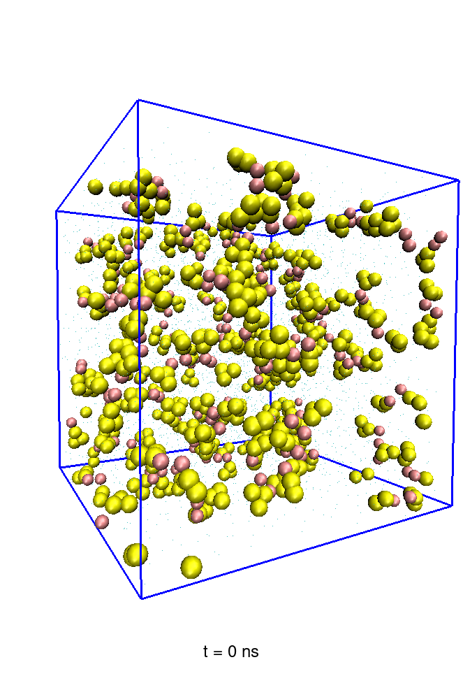
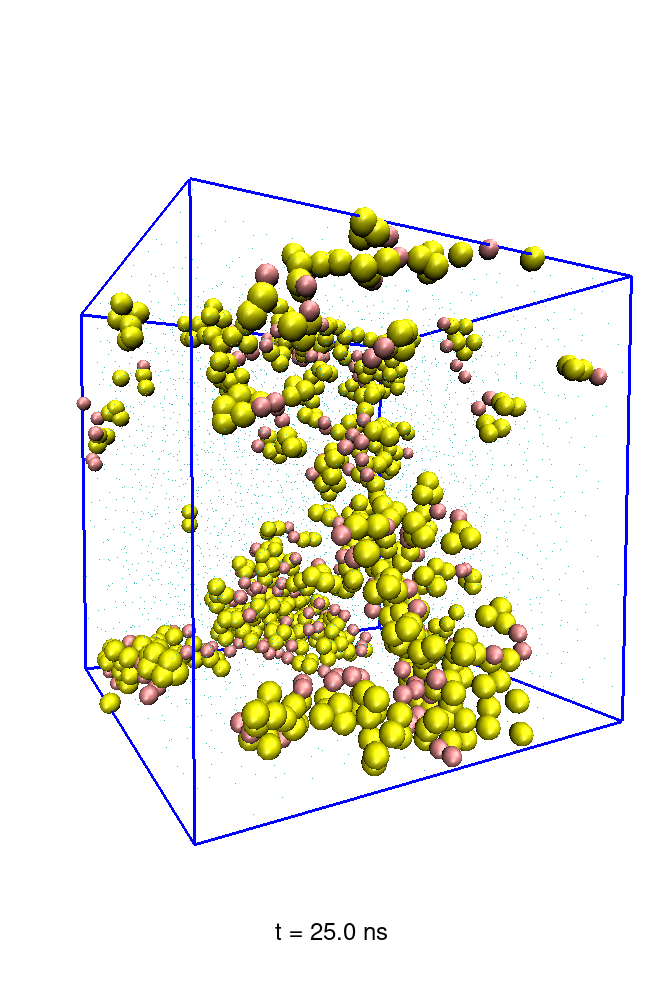

### Practice Projects

---

#### Host–Guest Multiscale Simulation

By combining molecular dynamics with quantum mechanics, a multi-scale simulation of the host-guest system was conducted. The stable structure of the single molecule was obtained through DFT calculations; classical molecular dynamics simulations were carried out; different clusters were selected for ONIOM calculations based on the classical molecular dynamics simulations; and the charge transfer relationship between the host and the guest was analyzed based on the calculation results.

Multi-scale calculation flowchart of subject and object:

---

#### Coarse-Grained Simulation of Peptides in Water

A coarse-grained model of peptides in water environment was constructed using the Martini force field. The aggregation phenomena and the interactions with the solvent were simulated.

Snapshots of the Simulation

  
  
  

---
