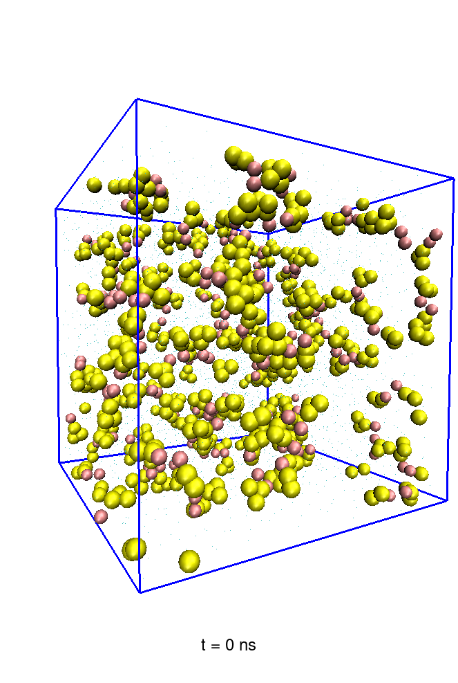
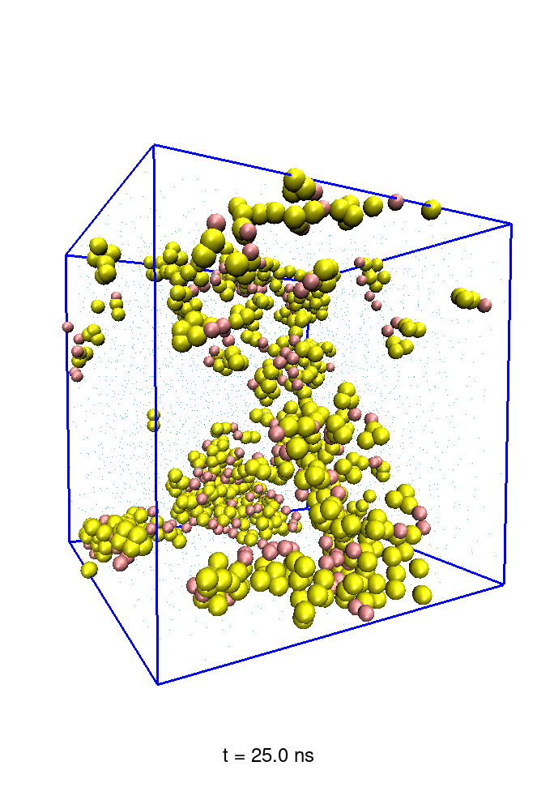

---

#### Host–Guest Multiscale Simulation

By combining molecular dynamics with quantum mechanics, a multi-scale simulation of the host-guest system was conducted. The stable structure of the single molecule was obtained through DFT calculations; classical molecular dynamics simulations were carried out; different clusters were selected for ONIOM calculations based on the classical molecular dynamics simulations; and the charge transfer relationship between the host and the guest was analyzed based on the calculation results.

Multi-scale calculation flowchart of subject and object:

---

#### Coarse-Grained Simulation of Peptides in Water

A coarse-grained model of peptides in water environment was constructed using the Martini force field. The aggregation phenomena and the interactions with the solvent were simulated.

Snapshots of the Simulation

  
  
  

---
#### Excited Analysis Tools 

A lightweight and extensible toolbox for excited-state analysis workflows. You can find the source code on [GitHub](https://github.com/wenwanzeng/ES_Analysis_Tools)

1.Multiwfn state-to-state spectrum tool

T-T absorption spectrum of the test molecule:

---

---
### Lennard-Jones Monte Carlo Practice

This practice project implements a Metropolis Monte Carlo simulation for a Lennard-Jones particle system in a periodic box, achieving lattice initialization, trial-move sampling, energy evolution analysis, radial distribution function \(g(r)\) calculation, and final-configuration visualization.You can find the source code on [GitHub](https://github.com/wenwanzeng/Practice_Record)

Monte Carlo simulation result:

---
